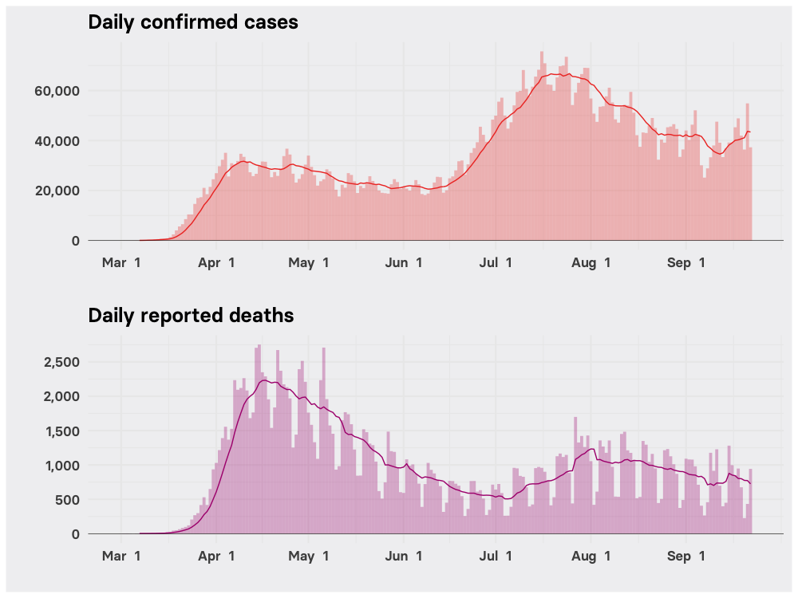

# COVID-19 Never Came Under Control In The US. It Just Shifted From Place To Place. 

```{r setup, include=FALSE}
knitr::opts_chunk$set(echo = TRUE, eval = FALSE)
```

Data and [R](https://www.r-project.org/) code used to make the maps and charts in this [Sep. 25, 2020 BuzzFeed News post](https://www.buzzfeednews.com/article/peteraldhous/us-coronavirus-patchwork-pandemic-maps) on shifting local hotspots of COVID-19 cases and deaths. Supporting files are in [this GitHub repository](https://github.com/BuzzFeedNews/2020-09-patchwork-pandemic).

### Setting up 

To show the shifting hotspots of COVID-19 confirmed cases and reported deaths across the US from March through September 2020, we mapped to US Census Bureau “[core-based statistical areas](https://www.census.gov/topics/housing/housing-patterns/about/core-based-statistical-areas.html).” These consist of a county or combination of counties containing at least one city with at least 10,000 people. While some rural areas excluded from this analysis have also been hit hard by COVID-19, this geographical view clearly reveals the shifting patchwork of hotspots of viral transmission that has characterized the US epidemic so far. 

A data processing pipeline to map COVID-19 cases and deaths to CBSAs from the county-level data [compiled by the New York Times](https://github.com/nytimes/covid-19-data) was developed previously by Jeremy Singer-Vine, BuzzFeed News data editor, for [this piece](https://www.buzzfeednews.com/article/peteraldhous/coronavirus-maps-charts-us-cities-deaths).

The map of CBSAs with the positions of Alaska and Hawaii shifted to allow a composite view was kindly provided by [Bob Rudis](https://rud.is/b/about/), author of the [albersusa](https://github.com/hrbrmstr/albersusa) R package.

The weeks analyzed run from Wednesday to Tuesday, and end on Sept. 22, the day the US passed 200,000 reported COVID-19 deaths. The animations also include the cumulative total of cases and deaths at the end of each week, processed from the New York Times's [national counts](https://github.com/nytimes/covid-19-data/blob/master/us.csv).

```{r}
# load required packages
library(tidyverse)
library(sf)
library(albersusa)
library(scales)
library(zoo)
library(lubridate)
library(patchwork)

# load states map for borders
states_map <- usa_sf() %>%
  select(fips_state)

# load CBSAs map and COVID-19 data
cbsa_map <- readRDS("data/us-cbsa.rds") %>%
  select(CBSA_ID)

cbsa <- read_csv("data/cbsa.csv")

# calculate weekly case and death rates for each CBSA
cbsa_weeks <- cbsa %>%
  mutate(week = week(date)) %>%
  arrange(cbsa_code, date) %>%
  group_by(cbsa_code) %>%
  mutate(new_cases = cases - lag(cases),
         new_deaths = deaths - lag(deaths),
         # set any negative case and death revisions to zero
         new_cases = case_when(new_cases < 0 ~ 0,
                               TRUE ~ new_cases),
         new_deaths = case_when(new_deaths < 0 ~ 0,
                                TRUE ~ new_deaths)) %>%
  group_by(cbsa_title,population,week,cbsa_code) %>%
  summarize(new_cases = sum(new_cases, na.rm = TRUE),
            new_deaths = sum(new_deaths, na.rm = TRUE)) %>%
  arrange(week) %>%
  group_by(cbsa_code) %>%
  mutate(new_cases_100k = new_cases / population * 10^5,
         new_deaths_100k = new_deaths / population * 10^5,
         date = parse_date_time(paste(2020, week, "Tue", sep = "-"),"Y-W-a"),
         cbsa_code = as.character(cbsa_code)) %>%
  ungroup()

# load cumulative US case and death totals for the end of each week
us_cases <- read_csv("data/us_weekly.csv")
```

### Animations of hotspots of COVID-19 cases and deaths

For the animated maps, we set each color scale so that it scaled linearly across ~99% of the values in the data for each CBSA and week. The remaining outlier values were assigned the same color as the highest end of the scale. This approach prevented the very high death rate in the New York City area in April from obscuring subsequent surges in death rates in other parts of the country. It also meant that the very high case rates reported for a minority of smaller CBSAs later in the epidemic did not obscure the initial outbreak in New York City and the surrounding area. (Nevertheless, the meaning of a "case" does inevitably change over the course the epidemic, as testing expanded and picked up more mild and symptomless infections.)

Making the animations from the individual frames requires [ImageMagick](https://imagemagick.org/index.php) to be installed.

```{r}
# make animation frames
for (w in 10:38) {
  tmp <- cbsa_weeks %>%
    filter(week == w)
  tmp <- left_join(cbsa_map, tmp, by = c("CBSA_ID" = "cbsa_code"))
  tmp2 <- us_cases_deaths %>%
    filter(week <= w)
  p1 <- ggplot() +
    geom_sf(data = states_map, color = NA, size = 0.1, fill = "#cccccc") +
    geom_sf(data = tmp, color = "white", size = 0.1, 
            aes(fill = new_cases_100k)) +
    geom_sf(data = states_map, color = "#808080", size = 0.15, fill = NA) +
    coord_sf(crs = us_laea_proj) +
    scale_fill_distiller(palette = "Reds", direction = 1, na.value = "#fee5d9", name = "Weekly cases per 100,000 people",
                         labels = comma,
                         limits = c(0, 450),
                         oob = scales::squish,
                         guide = guide_colorbar(
                           direction = "horizontal",
                           title.position = "top",
                           barwidth = 6,
                           barheight = 0.4
                         )) +
    theme_void(base_family = "Basier Square SemiBold", base_size = 6) +
    labs(title = format(max(tmp$date,na.rm=T), " %B")) +
    theme(panel.background = element_rect(fill = "#f1f1f2", size = 0),
          plot.background = element_rect(fill = "#f1f1f2", size = 0),
          panel.border = element_blank(),
          legend.direction = "horizontal",
          legend.position = c(0.8, 0.1),
          plot.title = element_text(size = 8, family = "Basier Square SemiBold"))
  ggsave(paste0("img/cbsa_cases_week/",w,".png"), plot = p1, width = 9.5, height = 7, units = "cm")
  p2 <- ggplot(tmp2, aes(x = week, y = cases)) + 
    geom_col(fill = "#ef3b2c", color = "#ef3b2c", alpha = 0.7, size = 0) + 
    theme_void(base_family = "Basier Square SemiBold", base_size = 6) +
    scale_y_continuous(limits = c(0,max(us_cases_deaths$cases))) +
    scale_x_continuous(limits = c(min(us_cases_deaths$week),max(us_cases_deaths$week))) +
    labs(title = paste(" Total cases:", prettyNum(max(tmp2$cases), big.mark = ","))) +
    theme(panel.background = element_rect(fill = "#f1f1f2", size = 0),
          plot.background = element_rect(fill = "#f1f1f2", size = 0),
          plot.title = element_text(size = 8, family = "Basier Square SemiBold"))
  ggsave(paste0("img/total_cases_week/",w,".png"), plot = p2, width = 9.5, height = 2.5, units = "cm")
  p3 <- ggplot() +
    geom_sf(data = states_map, color = NA, size = 0.1, fill = "#cccccc") +
    geom_sf(data = tmp, color = "white", size = 0.1, 
            aes(fill = new_deaths_100k)) +
    geom_sf(data = states_map, color = "#808080", size = 0.15, fill = NA) +
    coord_sf(crs = us_laea_proj) +
    scale_fill_distiller(palette = "RdPu", direction = 1, na.value = "#feebe2", name = "Weekly deaths per 100,000 people",
                         labels = number_format(accuracy = 1),
                         limits = c(0, 15),
                         oob = scales::squish,
                         guide = guide_colorbar(
                           direction = "horizontal",
                           title.position = "top",
                           barwidth = 6,
                           barheight = 0.4
                         )) +
    theme_void(base_family = "Basier Square SemiBold", base_size = 6) +
    labs(title = format(max(tmp$date,na.rm=T), " %B")) +
    theme(panel.background = element_rect(fill = "#f1f1f2", size = 0),
          plot.background = element_rect(fill = "#f1f1f2", size = 0),
          panel.border = element_blank(),
          legend.direction = "horizontal",
          legend.position = c(0.8, 0.1),
          plot.title = element_text(size = 8, family = "Basier Square SemiBold"))
  ggsave(paste0("img/cbsa_deaths_week/",w,".png"), plot = p3, width = 9.5, height = 7, units = "cm")
  p4 <- ggplot(tmp2, aes(x=week,y=deaths)) + 
    geom_col(fill = "#ae017e", color = "#ae017e", alpha = 0.7, size = 0) + 
    theme_void(base_family = "Basier Square SemiBold", base_size = 6) +
    scale_y_continuous(limits = c(0,max(us_cases_deaths$deaths))) +
    scale_x_continuous(limits = c(min(us_cases_deaths$week),max(us_cases_deaths$week))) +
    labs(title = paste(" Total deaths:", prettyNum(max(tmp2$deaths), big.mark = ","))) +
    theme(panel.background = element_rect(fill = "#f1f1f2", size = 0),
          plot.background = element_rect(fill = "#f1f1f2", size = 0),
          plot.title = element_text(size = 8, family = "Basier Square SemiBold"))
  ggsave(paste0("img/total_deaths_week/",w,".png"), plot = p4, width = 9.5, height = 2.5, units = "cm")
}

# append maps and charts
for (n in 10:38) {
  system(paste0("convert img/cbsa_cases_week/",n,".png img/total_cases_week/",n,".png -append img/cbsa_cases_week/",n,".png"))
  system(paste0("convert img/cbsa_deaths_week/",n,".png img/total_deaths_week/",n,".png -append img/cbsa_deaths_week/",n,".png"))
}

# make GIFs
system("convert img/cbsa_cases_week/*.png -set delay 50 img/cbsa_cases.gif")
system("convert img/cbsa_deaths_week/*.png -set delay 50 img/cbsa_deaths.gif")

# increase the delay on the final frame of each GIF
system("convert img/cbsa_cases.gif \\( +clone -set delay 300 \\) +swap +delete img/cbsa_cases.gif")
system("convert img/cbsa_deaths.gif \\( +clone -set delay 300 \\) +swap +delete img/cbsa_deaths.gif")
```

<br>


<br>


### Charts of daily COVID-19 confirmed cases and reported deaths

This chart is drawn from a snapshot of the data that underpins the main updating [BuzzFeed News coronavirus tracker](https://www.buzzfeednews.com/article/peteraldhous/coronavirus-deaths-cases-world-us-maps-charts). The processing pipeline for this data, again based on counts compiled by New York Times, was developed by Jeremy Singer-Vine and includes some corrections to remove peaks where anomalously large numbers of deaths were reported on a single day due to a change in reporting methods by an individual state.

```{r}
# load data and calculate 7-day rolling averages
daily_cases_us_deaths <- read_csv("data/us_daily.csv") %>%
  mutate(new_cases_mean7 = round(rollmean(new_cases, 7, align = "right", fill = NA)),
         new_deaths_mean7 = round(rollmean(new_deaths, 7, align = "right", fill = NA)))

# charts
p1 <- ggplot(daily_cases_us_deaths, aes(x = date)) +
  geom_col(aes(y = new_cases), fill = "#ef3b2c", color = "#ef3b2c", size = 0, width = 1, alpha = 0.3) +
  geom_line(aes(y=new_cases_mean7), color = "#ef3b2c", size = 0.5) +
  scale_x_date(breaks = seq(as.Date("2020-03-01"), as.Date("2020-09-01"), by = "month"),
               labels = format(seq(as.Date("2020-03-01"), as.Date("2020-09-01"), by = "month"), "%b %e")) +
  scale_y_continuous(labels = comma, breaks = pretty_breaks()) + 
  geom_hline(yintercept = 0, size = 0.2) +
  xlab("") + ylab("") +
  ggtitle("Daily confirmed cases") + 
  theme_minimal(base_family = "Basier Square SemiBold", base_size = 16) +
  theme(panel.background = element_rect(fill = "#f1f1f2", size = 0),
        plot.background = element_rect(fill = "#f1f1f2", size = 0)) 

p2 <- ggplot(daily_cases_us_deaths, aes(x = date)) +
  geom_col(aes(y = new_deaths), fill = "#ae017e", color = "#ae017e", size = 0, width = 1, alpha = 0.3) +
  geom_line(aes(y = new_deaths_mean7), color = "#ae017e", size = 0.5) +
  scale_x_date(breaks = seq(as.Date("2020-03-01"), as.Date("2020-09-01"), by = "month"),
               labels = format(seq(as.Date("2020-03-01"), as.Date("2020-09-01"), by = "month"), "%b %e")) +
  scale_y_continuous(labels = comma, breaks = pretty_breaks()) + 
  geom_hline(yintercept = 0, size = 0.2) +
  xlab("") + ylab("") +
  ggtitle("Daily reported deaths") + 
  theme_minimal(base_family = "Basier Square SemiBold", base_size = 16) +
  theme(panel.background = element_rect(fill = "#f1f1f2", size = 0),
        plot.background = element_rect(fill = "#f1f1f2", size = 0)) 

p1 / p2
```

<br>



